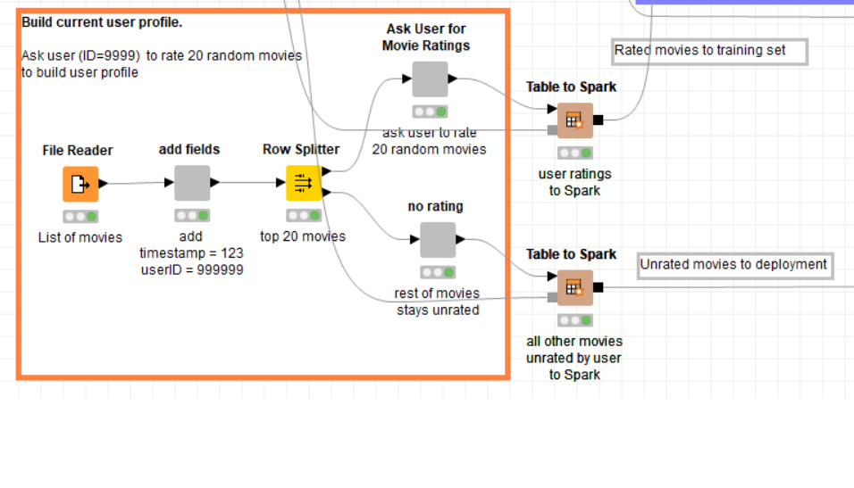
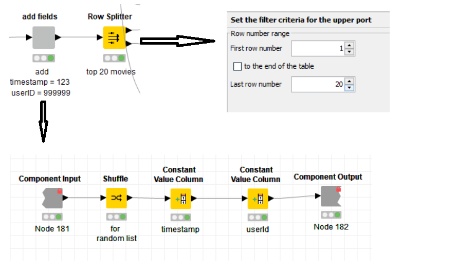
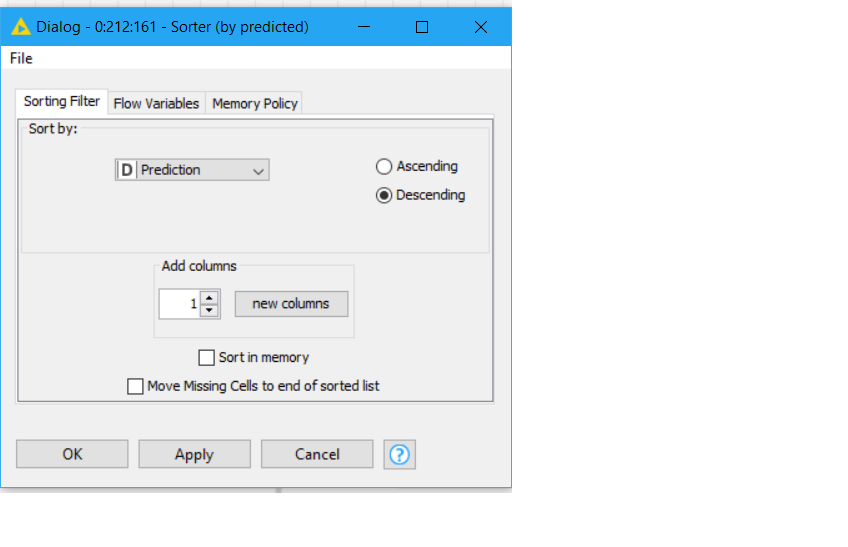

<h1>Tugas 3 Big Data</h1>

Tugas kali ini adalah mencoba algoritma rekomendasi menggunakan KNIME Workflow, dengan algoritma Collaborative filtering.

<h2>Tools yang dibutuhkan</h2>
<ul>
  <li>KNIME</li>
  <li>MovieLens 20M Dataset (http://files.grouplens.org/datasets/movielens/ml-20m.zip)</li>
</ul>

<h2> CRISP_DM</h2>

<h3>Business Understanding</h3>
  Pada tugas ini, saya mencoba suatu algoritma untuk merekomendasikan sesuatu berdasarkan kemiripan perilaku user tersebut dengan user lain. Algoritma ini dinamakan Collaborative filtering, dimana didasarkan pada Teknik ALS (alternating least squares). 
  Contoh kali ini adalah pemberian rekomendasi film berdasarkan kemiripan antara user satu dengan user lain dalam memberikan peringkat suatu film. Untuk dataset, saya menggunakan dataset MovieLens (20M). Dataset ini berisi kumpulan data film secara umum dengan peringkat film yang telah dinilai oleh banyak pengguna. 
<h3>Data Understanding</h3>
Dataset ini berisi sejumlah data berbeda terkait dengan judul dan peringkat film. Saya menggunakan dua file, yaitu rating.csv dan movies.csv  
Dataset dalam file ratings.csv berisi 20 juta peringkat film oleh sekitar 130.000 pengguna. Setiap baris berisi movieID (id film), userID(id user), rating(peringkat yang diberikan), timestamp(waktu). 
Dataset dalam file movies.csv berisi sekitar 27.000 film. Setiap baris berisi movieID(id film), title(judul film), dan genres(genre dari filmnya). 
<h3>Data Preparation</h3>
Pada persiapan data, saya menggunakan dua metode, yaitu file reader dan csv to spark. 
Sebelum mengolah data, kita siapkan dulu local spark contextnya,

  1. File Reader
  
    Pada data preparation untuk file reader, berikut adalah workflow yang dijalankan.
  
  
  
  
  
    Pada konfigurasi untuk file reader, saya membaca suatu table yang didownload sebelumnya, yaitu movies.csv.
    
  
  
  Table ini akan ditambahkan dua kolom, yaitu timestamps yang diisi 123 dan userID yang diisi 999999. Lalu data dibagi menjadi dua dengan row splitter, data pertama adalah data yang akan dilakukan training, yaitu 20 film yang telah di pilih secara acak, dan data kedua adalah film lainnya yang nantinya akan kita prediksi.
  
  
  
  20 film yang telah diberikan rating oleh user dari webview, dimana film ini akan dijadikan bahan training nantinya.
  
  
  
  
  
  Selanjutnya adalah menjalankan kedua node table to spark, dimana data yang telah berisi rate akan dikirimkan untuk di training, dan data yang tidak ada rate akan diprediksi nantinya, dan akan men-deploy suatu rekomendasi beberapa film untuk user tersebut.
  
  
  
  2. CSV to Spark
  
   Pada data preparation untuk spark, berikut adalah workflow yang dijalankan.
    
   
    
   Dalam membaca ratings.csv, saya menggunakan node CSV to Spark, dimana ini akan mengconvert CSV langsung menjadi table Spark. Berikut konfigurasinya: 
    
   
   
   Selanjutnya adalah dilakukan partisi 80% - 20% pada data csv, dimana 80% digunakan untuk training dan 20% digunakan untuk test.
   
   
   
   Setelah itu kita akan lakukan modelling.
    
<h3>Modelling</h3>

Untuk modelling, kita harus membuat sebuah ALS model untuk menggunakan algoritma ini. ALS model dibuat dengan spark collaborative filtering learner, dimana akan menghasilkan output berupa matrix factorization model. Output inilah yang akan kita buat untuk evaluasi dan untuk deployment. Sebelum dilakukan collaborative filtering learner, kita concate 80% film original dan 20% film yang telah diberikan rating oleh user. Untuk konfigurasinya:

<h3>Evaluation</h3>

Pada evaluation dijalan model seperti yang ada pada model workflow.

Jalankan node spark predictor untuk generate prediksi rating dengan test set 20% original film.

Selanjutnya adalah menjalankan node removal NaN untuk menghapus data NaN atau prediksi yang hilang, setelah itu jalankan spark numeric scorer untuk menghitung kesalahan (error) numerik antara peringkat film original dan peringkat yang diprediksi.

Berikut hasil perhitungan errornya:

<h3>Deployment</h3>

Selanjutnya adalah tahap terakhir, deploy sebuah model untuk memberikan top 10 prediksi film rekomendasi. Berikut workflownya

Lalu jalankan node spark predictor, untuk melakukan prediksi terhadap film yang belum dirating berdasarkan training data model.

Kemudian jalankan spark to table untuk memindahkan data dari spark ke dalam tabel, untuk memproses data dalam bentuk table knime. Setelah melakukan convert, kita hilangkan NaN prediction dan lakukan sorting terhadap rating, kita ambil 10 rating terbaik. Setelah itu lakukan join dengan movies.csv.

Berikut adalah konfigurasinya:

Hasil rekomendasi film untuk user adalah:

Kemudian jalankan node terakhir display recommendation, untuk men-generate suatu webview yang memperlihatkan hasil rekomendasi film tadi. Berikut hasilnya:

<h2>Perbandingan waktu</h2>

Perbandingan waktu antara CSV to Spark dan file reader, dimana saya menggunakan contoh dalam membaca rating.csv. Berikut konfigurasi kedua node:

Setelah menjalankan kedua node tersebut, saya membuat node timer info, dan inilah hasil dari timer info:

Dari hasil tersebut, dapat saya simpulkan bahwa node CSV to Spark lebih cepat dalam membaca file dibandingkan file reader.
